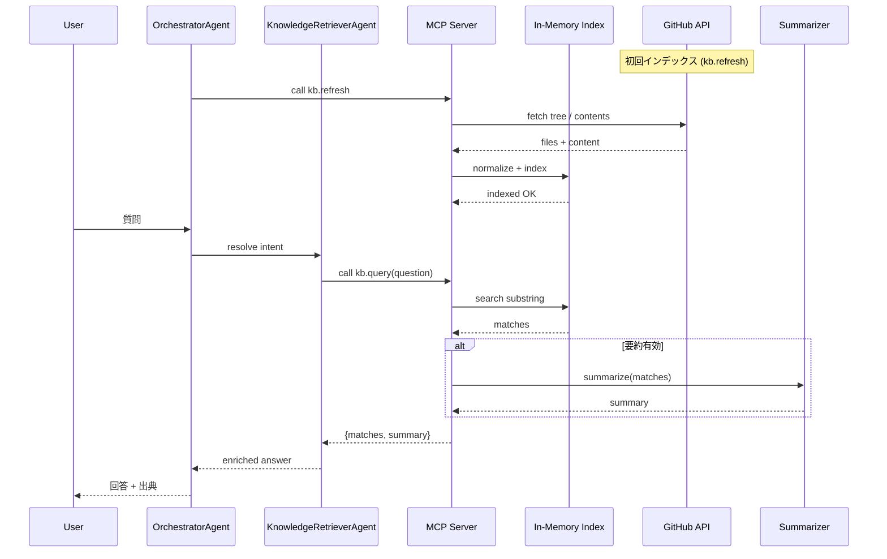
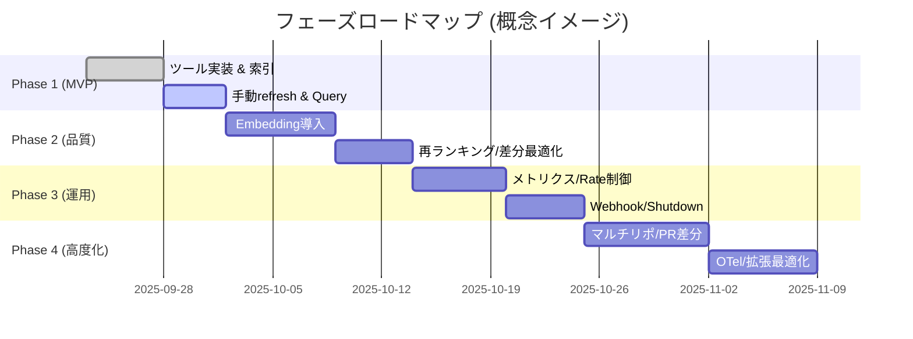
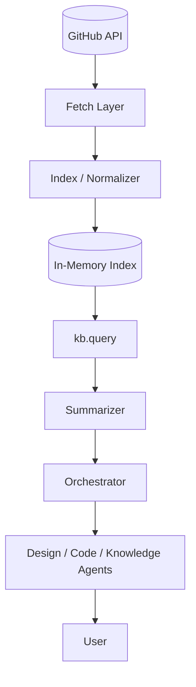
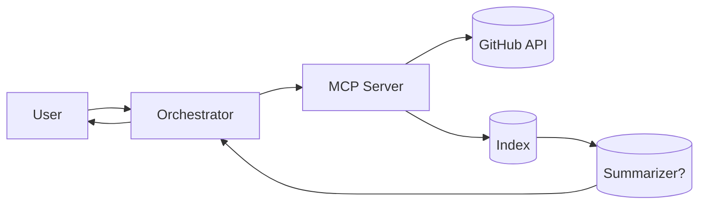
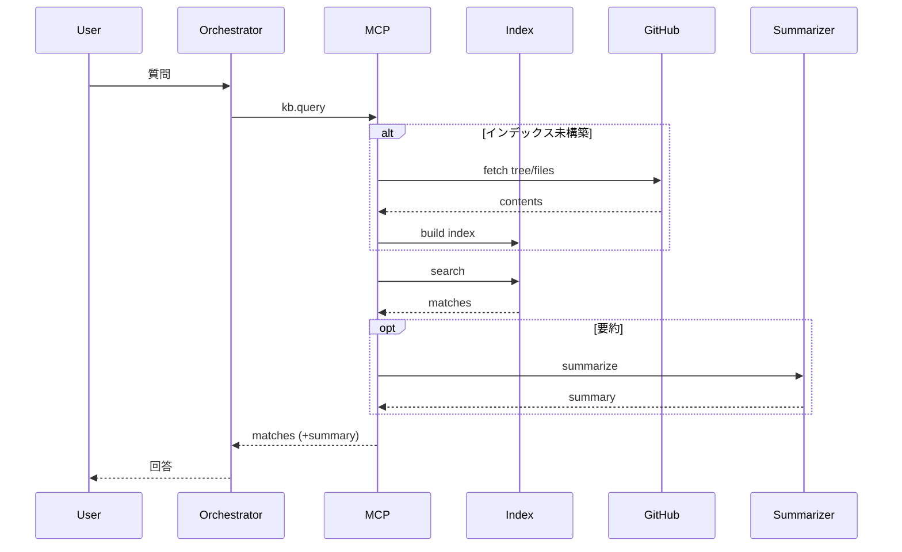
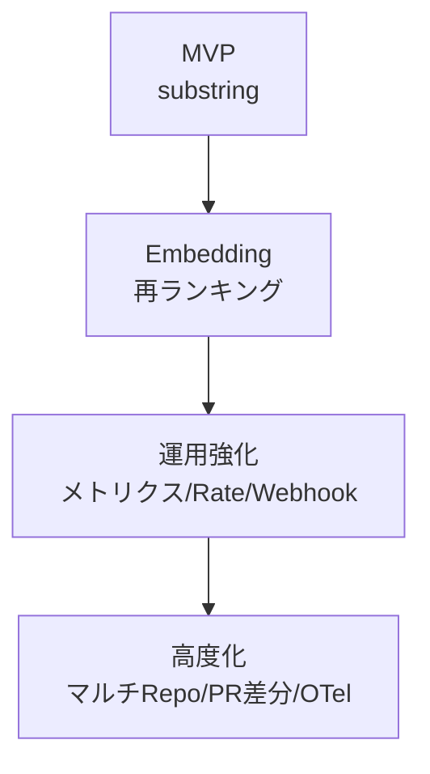
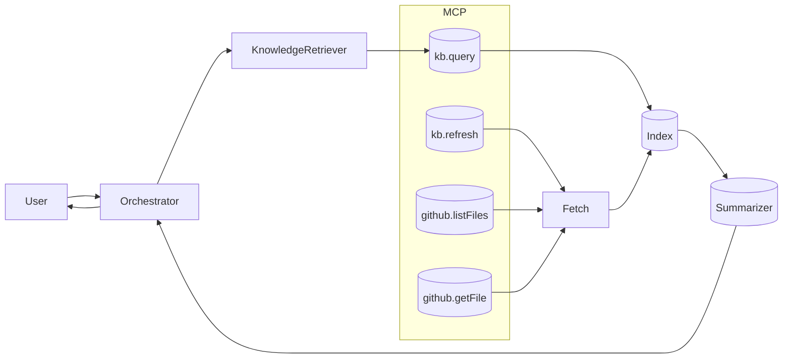

# GitHub ナレッジ連携によるエージェント設計支援 (MCP 拡張案)

## 1. 目的 / 背景
`docs/` / 追加予定の設計ガイド群を静的参照に留めず、MCP Server 経由でエージェントがオンデマンド活用できる知識レイヤに昇華する。  
設計レビュー初期負荷削減・回答一貫性向上・ナレッジ資産の再利用最大化を狙う。

## 2. 成果物ゴール
- リポジトリ内ドキュメントを API 化 (`listFiles` / `getFile` / `kb.query`)
- 設計質問に対し関連セクション抜粋＋要約 (将来 RAG) を返す
- 変更差分に追従する軽量再インデックス機構

## 3. スコープ (MVP)
| 含む | 含まない (将来) |
|------|------------------|
| Markdown ファイル取得/検索 (substring) | ベクトルDB 永続化 |
| 手動 `refresh` | GitHub Webhook 自動トリガ |
| シンプル要約 (任意 LLM) | 高度再ランキング / OTel トレース |
| 単一リポ対象 | マルチリポ統合 |

## 4. アーキテクチャ概要
```mermaid
flowchart LR
  subgraph Client[User / 開発者]
    U[User Query]
  end
  subgraph AgentLayer[Agent Layer]
    OA[OrchestratorAgent]
    DA[DesignAdvisorAgent]
    CN[CodeNavigatorAgent]
    KR[KnowledgeRetrieverAgent]
  end
  subgraph MCPS[MCP Server]
    T1[(github.listFiles)]
    T2[(github.getFile)]
    T3[(kb.refresh)]
    T4[(kb.query)]
  end
  subgraph DataCore[Knowledge Core]
    FL[Fetch Layer\n(GitHub API)]
    IX[(In-Memory Index)]
    SUM[(Summarizer / LLM)]
  end

  U --> OA
  OA --> DA
  OA --> CN
  OA --> KR
  KR --> T4
  CN --> T1
  CN --> T2
  T4 --> IX
  T3 --> FL --> IX
  T2 --> FL
  SUM --> OA
  KR --> SUM
  IX --> SUM
```

### 主コンポーネント
- Fetch Layer: GitHub API (tree + contents) + ETag / SHA キャッシュ
- Indexer: Markdown 正規化 + セクション分割 + メタ (path, heading, hash)
- Query Engine: substring マッチ + スコア (頻度/位置) ソート
- Tools: `github.listFiles`, `github.getFile`, `kb.refresh`, `kb.query`
- (Optional) Summarizer: LLM / ルールベース抜粋

## 5. ツール API 草案
```ts
// github.listFiles { pathPrefix? } → { files: { path, size, sha }[] }
// github.getFile { path } → { path, content, sha }
// kb.refresh { full?: boolean, force?: boolean } → { updated: number, skipped: number }
// kb.query { question: string, topK?: number } → { matches: [{ path, snippet, score }], summary?: string }
```

## 6. データフロー
1. 初回: tree API 走査 → Markdown 抽出 → 正規化 (front-matter 除去, heading 抽出)
2. ハッシュ化 (content sha) → 既存キャッシュと差分比較 → 変更/追加のみ再構築
3. `kb.query`: 質問 → keyword 抽出 (簡易: トークン化) → セクション走査 → 上位抽出 → (任意で要約)
4. 応答: { matches, summary, meta(version/hash) }



## 7. フェーズ別ロードマップ
| フェーズ | 目的 | 主要タスク |
|----------|------|------------|
| 1 (MVP) | 基本参照 & 検索 | ツール4種 / インメモリ索引 / 手動 refresh |
| 2 | 品質向上 | Embedding + ベクトル近傍 / 再ランキング / 差分更新最適化 |
| 3 | 運用拡張 | メトリクス / レート制御 / Webhook / Graceful Shutdown |
| 4 | 高度化 | マルチリポ / PR コンテキスト差分レビュー / OTel トレース |



## (補足) コンポーネント依存関係 (概念)


## 8. リスクと対策
| リスク | 内容 | 対策 |
|--------|------|------|
| Rate Limit | API 呼び出し過多 | ETag 利用 / 差分 Only / バックオフ |
| 鮮度遅延 | 差分反映遅れ | 手動 `kb.refresh` + 短周期ポーリング (設定化) |
| ノイズ多 | 単純 substring 過検出 | セクション単位・見出し優先スコアリング |
| コスト増 (将来 Embedding) | 再計算頻度過多 | content hash 比較で増分 Embed |
| 機微流出 (将来 private) | 秘匿文字列露出 | パス/パターン除外 + 機微トークン redact |
| 回答幻覚 | LLM 推測 | 回答末尾に参照一覧 / 出典未検出時 “不明” 明示 |

## 9. KPI (初期)
| 指標 | 目標 |
|------|------|
| 関連ファイル Hit 率 | >80% (手動評価) |
| `kb.query` p95 Latency | < 800ms |
| 初回インデックス時間 | < 5s |
| 差分再構築無駄率 | < 20% |
| エラー率 | < 1% |

## 10. 実装順序 (詳細)
1. GitHubClient (fetch + ETag) ラッパ
2. ツール 4 種登録 (静的レジストリ)
3. Markdown 正規化 + シンプル索引 (配列保持)
4. `kb.query` substring / heading ブースト
5. 任意 LLM 要約 (環境変数で有効化)
6. 差分 refresh (hash 比較)
7. Embedding フラグ追加 (Phase2 移行)

## 11. 運用 / 設定例
```jsonc
// config/github-access.json (想定)
{
  "repo": "masami-ryu/agent-system-design-support",
  "branch": "main",
  "includeGlobs": ["docs/**/*.md", "resources/**/*.md"],
  "excludeGlobs": ["**/draft/**"],
  "pollSeconds": 300,
  "maxFileKB": 256
}
```

## 12. セキュリティ / プライバシ留意
- Private リポ前提化時は最小権限 Token (contents:read)
- エラーログへコンテンツ原文を出さない (ハッシュのみ)
- LLM 送信前に除外語（apiKey / secret 等）簡易フィルタ

## 13. 将来拡張アイデア
- PR 差分自動レビュー (変更行→関連 docs セクション列挙)
- ADR 優先スコアリング (ファイル名 pattern: `architecture_decision_*`)
- キャッシュ層を SQLite 化し再起動即ウォーム
- 参照頻度ランキングから docs 改善レコメンド

## 14. 導入メリット再掲
- 設計レビュー初期調査コスト削減 / 回答標準化
- ナレッジ鮮度維持 (変更即参照可能) によるドキュメント価値向上
- エージェント活用事例として再利用性高いテンプレ化

## 15. 次アクション (MVP)
1. `config/github-access.json` 追加
2. `GitHubClient` / `Indexer` スケルトン実装
3. ツール 4 種 + 登録ロジック追加
4. README に “GitHub Knowledge Access (MVP)” 節リンク
5. 簡易シナリオテスト (3 質問 / 期待ファイル Hit 確認)
6. Phase2 Issue 起票

---
本ドキュメントは段階的拡張を前提としたアーキ設計メモです。実装開始時は MVP 範囲逸脱を避け、計測指標 (KPI) 収集後に Phase2 へ進みます。

## 16. PR 用簡略図セット (貼り付けテンプレ)

### 16.1 High-level アーキ (最小)


### 16.2 簡略クエリフロー


### 16.3 フェーズ遷移 (圧縮)


### 16.4 中間詳細図 (任意)


### 16.5 PR 用説明テンプレ (Markdown)
```
### GitHub Knowledge Access (MVP)
本PRは docs/ ナレッジを MCP ツール経由で参照可能にする基盤を追加します。

#### アーキ (High-level)
[High-level Mermaid 図貼付]

#### クエリフロー
[簡略クエリフロー図貼付]

#### 現在スコープ
- substring 検索 / 手動 refresh / 要約オプション (LLM 環境変数で有効化)

#### 次フェーズ予定
- Embedding + 再ランキング, 差分最適化, メトリクス
```

