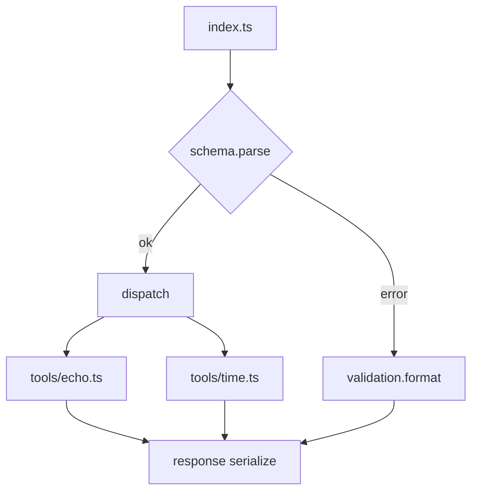

# ディレクトリ構成 (mcp-server)

本ドキュメントは `mcp-server/` サブプロジェクトの物理構成とそれぞれの責務境界、変更指針を整理したものです。README は最小利用手順、ADR は意思決定履歴、本書は構造の“現時点スナップショット”を提供します。

> 更新ルール: 構成(フォルダ/主要ファイル)に意味的変更が入ったら PR 内で本ファイルも更新し、必要に応じ ADR の *Implementation Plan* / *Future Work* を見直してください。

---
## 1. ルートツリー
```
mcp-server/
├── README.md                      # Quick Start (利用最小手順)
├── package.json                   # 依存とスクリプト (Node 22 / Yarn v4)
├── tsconfig.json                  # 開発用(extends base)
├── tsconfig.build.json            # ビルド出力用 (emit 設定)
├── tsconfig.base.json             # 共通 (strict 設定集中)
├── src/
│   ├── index.ts                   # stdin/stdout ループ (JSON-RPC 風 dispatcher)
│   ├── core/
│   │   └── validation.ts          # Zod エラー整形など共通検証ユーティリティ
│   ├── schema/
│   │   └── toolCallRequest.ts     # 入力リクエストスキーマ (Zod)
│   └── tools/
│       ├── echo.ts                # 例: 入力文字列反射ツール
│       └── time.ts                # 例: 現在時刻返却ツール
├── docs/
│   ├── architecture_decision_record.md  # 技術選定と将来計画 (ADR)
│   ├── mcp_jsonrpc_learning_guide.md    # MCP / JSON-RPC 学習ガイド
│   └── directory_structure.md           # (本ファイル)
├── .yarnrc.yml                    # Yarn v4 設定 (nodeLinker=node-modules)
├── yarn.lock                      # 依存ロック
├── .nvmrc (または ルートに .node-version) # Node バージョンピン (22)
└── dist/                          # ビルド成果物 (git ignore 対象)
```

## 2. レイヤ責務サマリ
| レイヤ | 役割 | 変更頻度 | 注意点 |
|--------|------|----------|--------|
| `src/index.ts` | エントリ / ループ制御 / ディスパッチ | 中 | ロジック肥大防止: 検証/変換はユーティリティへ抽出 |
| `src/core` | 横断関心 (検証, ログ, 将来: メトリクス) | 低〜中 | 外部ライブラリへ強く依存しすぎない薄い抽象を維持 |
| `src/schema` | Zod スキーマ (契約) | 中 | スキーマ変更時は後方互換性影響を PR で明示 |
| `src/tools` | 個別ツール実装 | 高 | 入力スキーマは可能な限り局所化 (重複時 compose) |
| `docs` | 学習/判断資料 | 中 | ADR に“決定”/本書に“構造”を分離保持 |
| `dist` | 出力 | - | 生成物のみ。手動編集禁止 |

## 3. ツール追加ガイドライン (簡易)
1. `src/tools/<name>.ts` を作成
2. 必要ならローカル Zod スキーマ定義 & パース
3. `index.ts` のレジストリへ登録
4. (後続) テスト追加予定: `test/<name>.test.ts`

## 4. 将来予定構造 (例)
```
src/
  core/
    logger.ts         # pino ラッパ (予定)
    metrics.ts        # 実行回数/レイテンシ集計
  schema/
    toolCallResponse.ts
  tools/
    math/
      add.ts
      subtract.ts
  test/
    tools/
      echo.test.ts
```

## 5. Mermaid (概念構造)


## 6. 更新トリガ例
| トリガ | アクション |
|--------|-----------|
| ツール数が増え registry が煩雑 | 動的ロード仕組み導入 & ディレクトリ規約化 |
| スキーマファイルが肥大 | フォルダ階層 (`request/`, `response/`) 分割 |
| 観測性要件追加 | `core/logger.ts` / `core/metrics.ts` 新設 |
| バリデーションパターン重複 | 共通 compose ユーティリティ抽出 |

## 7. メンテナンスポリシー (抜粋)
- スキーマ変更は *セマンティック・バージョン* 影響を PR 説明へ注記 (例: 破壊的 → major)
- 例外処理は `index.ts` 側で集中捕捉しツール内ではなるべく throw に単純化
- 1 つのツールファイル 150 行超過で分割検討

---
この構成図は現状の基準点です。大きな構造変更の前に ADR の Review Triggers を再確認してください。
