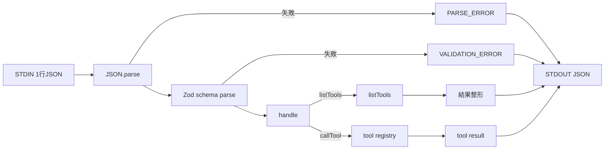

# MCP / JSON-RPC ラーニングガイド

> 旧ファイル名: `beginner_guide_mcp_jsonrpc.md` (学習導線をより明確にするためリネーム)

このガイドは *最短で* 「MCP Server の役割」と「JSON-RPC 風プロトコルの読み方」を理解し、リポジトリの最小実装を改造できる状態になることを目的としています。内容は旧ファイルと同等で、名称のみより包括的な *Learning Guide* という語に調整しました。

> 以下のコンテンツは元ガイドの内容をそのまま移行しています。

---
## 1. 用語ざっくり定義
| 用語 | 一言で | もう少し詳しく |
|------|--------|----------------|
| MCP (Model Context Protocol) | LLM 用の拡張窓口 | LLM / エージェントが外部の“能力” (ツール・リソース・プロンプト) を標準化インタフェースで呼び出す仕組み |
| MCP Server | 能力提供プロセス | ツール群・リソース参照などを公開し、クライアント(IDE/エージェント)からの要求を受ける側 |
| MCP Client | 利用側 | VS Code Agent Mode など。サーバーと対話し利用可能なツールを列挙・実行する |
| Tool | 呼び出せる操作 | パラメータを受けて結果を返す。副作用あり/なし両方ありうる |
| (JSON-)RPC | リクエスト/レスポンス形式 | method / params / id で操作を表現する軽量なプロトコルファミリ |
| JSON-RPC 風 | 厳密実装ではないが似た形 | 必要最小限のフィールドだけを採用した簡易プロトコル |
| Validation (検証) | 入力の健全性確認 | 不正データを早期で弾き安全性と予測可能性を高める |

---
## 2. なぜ MCP が必要になるのか
LLM を使うだけでは「リポジトリの現在状態」「DB/外部APIの最新データ」「特定システム操作」を直接安全に扱えません。MCP を挟むことで:
1. 能力列挙 (listTools)
2. 能力呼び出し (callTool)
3. 標準化された失敗コードや入力検証
が行われ、LLM エージェントの“世界との接点”を統制できます。

---
## 3. JSON-RPC の基本最小形
```jsonc
// リクエスト例 (ツール一覧)
{"id":"1","method":"listTools"}

// リクエスト例 (echo ツール呼び出し)
{"id":"2","method":"callTool","params":{"name":"echo","args":{"text":"hello"}}}
```
レスポンス例:
```jsonc
{"id":"1","result":{"tools":[{"name":"echo"},{"name":"time.now"}]}}
{"id":"2","result":{"text":"hello"}}
```
失敗例 (未知ツール):
```jsonc
{"id":"3","error":{"code":"NOT_FOUND","message":"tool unknownTool not found"}}
```

---
## 4. このリポジトリ実装と JSON-RPC の対応
| JSON-RPC 風フィールド | どこで生成/使用 | 役割 |
|----------------------|----------------|------|
| id | クライアントが任意付与 | 応答と関連付け (並列要求時に必須) |
| method | クライアント指定 (`listTools` / `callTool`) | 実行したい操作識別子 |
| params | クライアント指定 | 操作引数 (ここでは柔軟 any → 個別に再検証) |
| result | サーバー側 `handle()` 内で生成 | 成功時の値 (任意構造) |
| error | サーバー側 `handle()` / バリデーション | 失敗コード + メッセージ |

---
## 5. データフロー (概念図)


---
## 6. スキーマ検証 (Zod) の狙い
| 課題 | 検証がないと | Zod 導入で |
|------|---------------|-------------|
| 不正 JSON | ランタイム例外 | PARSE_ERROR で統一応答 |
| method typo | 予期しない分岐 | METHOD_NOT_FOUND 明示 |
| params 構造崩れ | ツール内で失敗 | 入口で VALIDATION_ERROR |
| 型安全 | any だらけ | 推論型で補完 & バグ削減 |

---
## 7. 典型的なエラーコード (この実装)
| code | いつ出る | 返却主体 |
|------|----------|-----------|
| PARSE_ERROR | JSON.parse 失敗 | メインループ | 
| VALIDATION_ERROR | Zod パース失敗 | メインループ |
| BAD_REQUEST | 必須パラメータ欠落 (name など) | handle() |
| NOT_FOUND | 未登録ツール名 | handle() |
| TOOL_ERROR | ツール内部例外 | handle() |
| METHOD_NOT_FOUND | 未定義の method 値 | handle() |

---
## 8. ツールレジストリの最初の姿
```ts
const tools = {
  'echo': {
    run: (args) => echo(echoInputSchema.parse(args)),
    inputSchema: echoInputSchema
  },
  'time.now': {
    run: () => timeNow()
  }
};
```
将来は:
- 動的ロード (tools ディレクトリ走査)
- JSON Schema 生成でクライアントへ型ヒント配布
- 実行時間メトリクス記録 / レート制限

---
## 9. 学習ステップ (ロードマップ)
| ステップ | ゴール | 次の指針 |
|----------|--------|----------|
| 1. README 操作 | server を起動・listTools 確認 | echo を改造してみる |
| 2. Zod 触れる | スキーマ変更でバリデーション挙動を体験 | 失敗応答を追加整形 |
| 3. 新ツール追加 | `math.add` などを実装 | エラーケーステスト作成 |
| 4. テスト導入 | Vitest で正常/異常系カバー | CI 自動化 |
| 5. 観測性 | ログ→簡易メトリクス | OTel 検討 |
| 6. 将来 | JSON Schema export / PnP 再評価 | スケール設計 |

---
## 10. 追加の練習課題アイデア
1. `time.now` にタイムゾーン指定引数を追加 (Zod enum + 変換)
2. `echo` を `echo.upper` として大文字化オプションを追加
3. 不正サイズ (>10KB) の `text` でエラーを返すガードを入れる
4. `math.add` (配列の合計) ツール + 負数禁止バリデーション
5. 全ツール実行時間(ms)を計測しログへ出すラッパ実装

---
## 11. 参考リンク
| 分類 | リンク |
|------|--------|
| JSON-RPC 公式 | https://www.jsonrpc.org/specification |
| Zod | https://github.com/colinhacks/zod |
| Yarn | https://yarnpkg.com/ |
| TypeScript Handbook | https://www.typescriptlang.org/docs/ |

---
## 12. 次に読むべきファイル
| ファイル | 目的 |
|----------|------|
| `src/index.ts` | 入力→検証→ディスパッチ全体像 |
| `src/tools/echo.ts` | スキーマ + シンプルツール例 |
| `src/core/validation.ts` | エラー整形方法 |
| `docs/architecture_decision_record.md` | 技術選定と将来計画 |
| `README.md` | 実行の最短手順 |

---
このガイドで概要を掴んだら、まずは echo ツールを拡張しながら挙動を壊してエラーパターンを観察してみてください。壊して直すサイクルが最速の理解への近道です。
